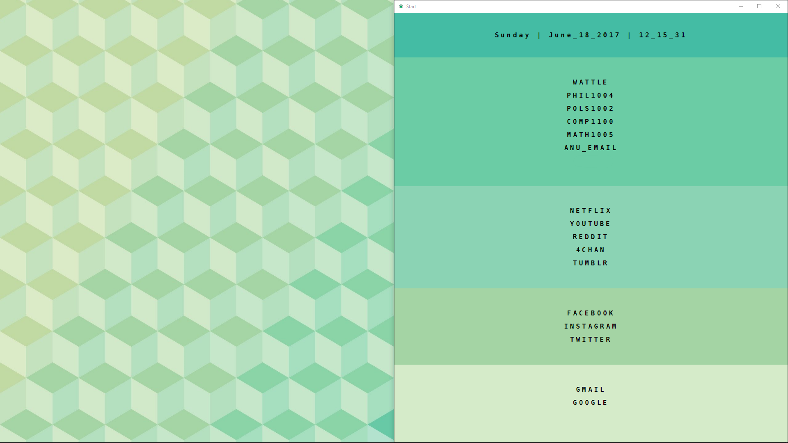

# start_rishd

A simple startpage by [rishd](https://www.reddit.com/r/startpages/comments/6ak6qd/new_to_rstartpages_and_been_lurking_for_a_while/) with date/time and links. To use, copy `index.html`, `stylesheet.css` and `icon.png` in the same directory and set your new tab page to `index.html`, all the links and text can be changed within that file, the background shown is `background.jpg`.

